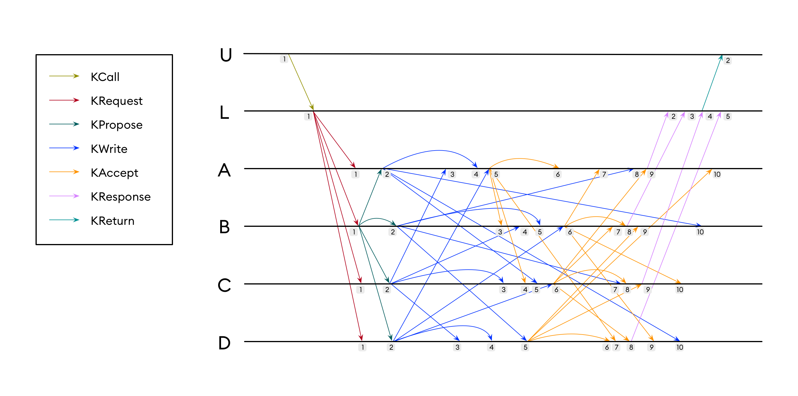
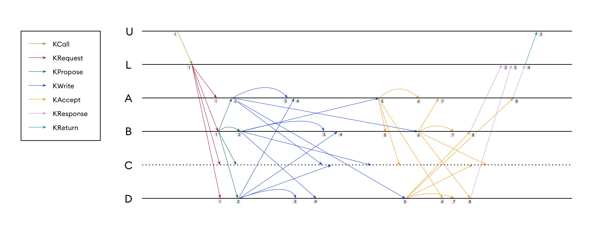
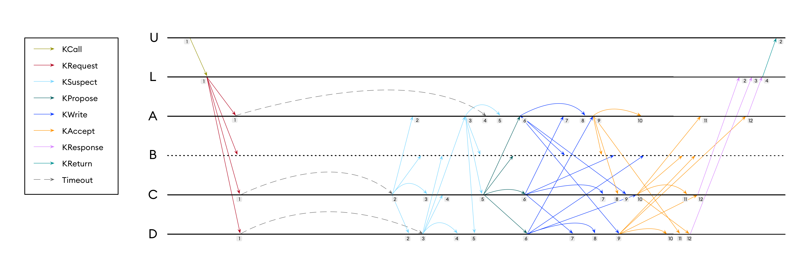
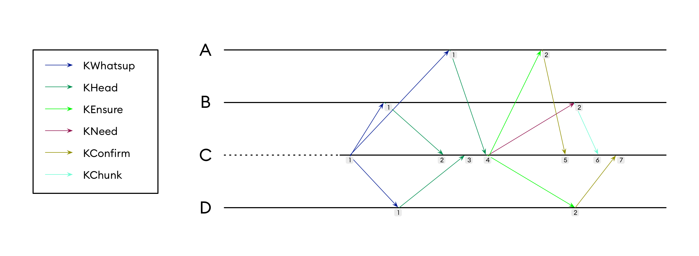
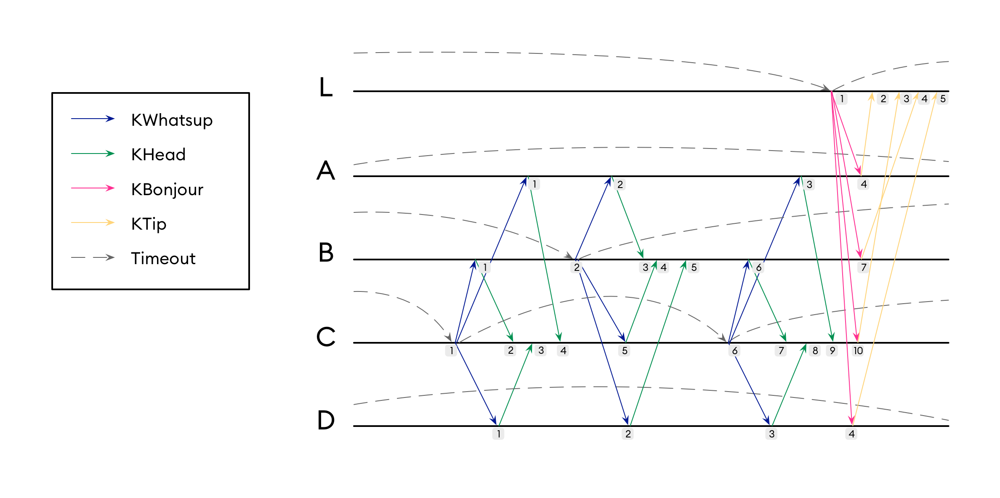

### About

To avoid verticalization of code, each type of exchange between distributed processes has its own named message bearing the data of the exchange. No general containers like "KMessage" is used. The approach helps to avoid different kinds of switch cases (by type, by enum value or flag) and their combinations. It also eliminates the questions of the kind "is the field A is used when the flag F is set?". The drawback, however is that it leads to some duplication of data fields (see [types.go](../types.go)). It requires to design many types of messages, some even without payload, to represent all possible communications between distributed processes.

This document aims to clarify message exchanges in various states of BFT algorithm: normal mode, faults, catch-up and idle. It also highlights some key points of consensus protocol, for the complete description see [References](README.md#references).

### Examples

In our examples we will assume a system with six processes:

* four server processes: `A`, `B`, `C` and `D`
* one client process `L`
* one user process `U`

User process is the one that uses Kayak to store data, it's external to the library. Technically, user and client processes are parts of a single binary and communicate through funtction calls, not through the network. They're kept separated purely for clarity.

We will also say that the current leader is process `B`, and, if it fails, `C` should take its place.

Each process has its local timer, which is incremented each time a message or timeout is received. To reference an event of process `C` happened at time `7`, we will simply put `C_7`.

In the case of four server processes byzantine quorum equals three, which explains why in almost all cases process unblocks on third confirmation.

If not mentioned otherwise, "sending to all server processes" or "broadcast" includes sending to itself. The code could optimise this case to avoid involving network stack of loopback interface, but it doesn't change much from the algorithmic point of view. Upon reception, any message is handled the same way, whether it has been sent by the other process or by the same.

### Normal mode

Most of the time all processes are up and running, none of them runs some mallicious Byzantine code, network conditions are good, meaning that all messages are delivered in time, and all processes are perfectly synchronized, i.e. they all have the same transaction log. We will call these conditions normal mode. In normal mode there's always some flow of entries to be added, originating from clients. It is needed to distinguish normal mode from idle mode when nothing happens.

Consensus protocol runs in rounds. Each round results into adding a single log entry. New round is initiated by user code at `U_1`. User code calls `kayak.ReceiveCall` and puts `KCall` as a single argument. `KCall` contains arbitrary data blob to be added along with the tag.

At some point `U` receives back the status of the call in the form of `KReturn`. Since `U` submits calls asynchronously, upon reception of `KReturn` it should know which call it corresponds to. Both `KCall` and `KReturn` contain the tag. `U` randomly generates the tag for each call, which is then reappears `KReturn` to identify the original call. Client `L` guarantees that all calls will be answered, whether with success or with error.

When `L` receives the call, it broadcasts `KRequest` message to all servers. The message contains the data blob from original `KCall`. Once `L` finishshed the broadcast it waits till it receives three identical `KResponse` messages. In our case that happens at `L_4` when the `KReturn` is sent back. If it doesn't happen, after the timeout `KReturn` is sent anyway with the corresponding indication of failure. Sending by timeout requires setting the timer. The timer is set at `L_1`, but in our (normal) case it's not triggered, and therefore is not shown on the schema.

All four server processes receive the same `KRequest`, but only process `B` proceeds, since the process `B` is the leader. `B` at `B_1` sends to all server processes `KPropose` message, implementing first phase of the consensus round.

When a server receives `KPropose`, it immediately broadcasts `KWrite`. `KWrite` contains the hash of the data previously received in `KPropose`. Hashing helps to reduce the amount of data being exchanged over the network.

After sending of `KWrite` each server waits till it receives three identical `KWrite` messages from other servers. It happens at `A_5`, `B_6`, `C_6` and `D_5`. The local times does not match since we assume that the messages arrive out of order, and processes are not synchronised in any way that is not implemented by the protocol itself. The exchange of `KWrite`s implements the second phase of the round.

When enough `KWrite` messages received, the servers repeat the broadcast with `KAccept` messages. At `A_8`, `B_8`, `C_9` and `D_8` enough (three) identical `KAccept` are received. That terminates the third phase of the round. Servers report back the successeful termination with `KResponse` message. At client side, three identical responses received at `L_4`.

In normal case a process waits for three out of four messages, and then proceeds. At some point later in time the fourth message may arrive. That's the case of `A_8`, `A_10`, `B_9`, `B_10`, `C_7`, `C_10`, `D_9`, `D_10` and `L_5`. These messages are of no use and just discarded.

### Faulty follower

The primary goal of a distributed system is the resiliency from failures. Byzantine fault-tolerant system resists to failures of any kind: crash, omission or arbitrary behaviour. In our simplified examples we will focus only on crash failures. It will help to understand the behaviour of the protocol and, to some extent, to prove its correctness. For Byzantine faults, that practical approach would not be enough, as one has to imagine all possible faulty behaviours, which is impossible. To prove Byzantine fault resistance, only theoretical framework can be used.

In our next example we will suppose that a server process `C` crashes, and its crash is seen by the other processes as the absence of messages of any kind. `C` is the follower, and its crush is somewhat lightweigh, since it doesn't require running leader change procedure.

For simplicity we assume exactly the same message exchange pattern as in normal case. Crashed follower doen't affect the outcome, and the client's code receives the confirmation of added record at `U_2`. However, comparing to the normal case, it takes a bit longer to reach the consensus. In normal case processes wait till any first three confirmation of `KWrite` and `KAccept` out of four. If one of the processes in crased, all others will have to wait for all three out of three. That's why the processes will have to wait till `A_5`, `B_6`, `D_5`, `A_8`, `B_8` and `D_8` before they are unblocked.

It is quite clear that with two failed followers the remanining server processes would be completely blocked as they would never receive three confirmations. This feature express the principle *first safety, then liveness*: it's better to not to reach any consensus at all, rather to come up with different outcomes, beliving to be the result of a consensus.

### Faulty leader

In the case when the crashed process happens to be the leader, all other processes will have to appoint a new leader before they can proceed. We will now shut down process `B`, which is leader, and is responsible for sending `KPropose`s to start a new consensus round.

For a follower, the only way to understand that the leader is crashed, is to check if there are some `KRequest`s for which the consensus did never run. To do so, upon reception of `KRequest`, a process starts a timer. If the timer expires, it makes the follower to suspect the current leader. And, on the contrary, if the request has been added as a record through a consensus round, the corresponding timer is cancelled.

When the leader crashes, no `KRequest` is sent, and timers launched at `A_1`, `C_1` and `D_1` will eventually expire. When it happens at `C_2` and `D_3` the corresponding processes broadacst `KSuspect` message.

If a process at some point receives two (out of four) [*] correct `KSuspect` messages, it automatically becomes suspicious itself and broadcasts its `KSuspect` to others. That what exactly happens at `A_3`. The process `A` becomes suspicious not because of the expired timer, but because of others which are suspicious too.

If a process at some point receives three (out of four) correct `KSuspect` messages, it understands that the leader change process is over, and next leader should be now considered. That occurs at `A_5`, `C_5` and `D_5`. We assume that the leaders are changed by the simple round-robin algorithm: `A -> B -> C -> D -> A -> B -> ...`, and it's known to all processes. That means, that, technically, the processes do not *elect* a new leader, but rather agree to move the leadship to the next one. This deterministic approach differs from others, implemented in crash fault tolerant systems, like [Raft](https://raft.github.io/)

Finally, the process `C` at `C_5` understands that it has now to act as the leader, and fulfills its duty by broadcasting `KPropose`. From this point the rest of the execution does not differ from the crashed follower case, since the crashed `B` is the follower now.

[*] In general case, it's enough to receive 1/3 + 1 confirmation for a process to become suspicious. In case of two nodes, it results to two.

### Catch-up

### Idle mode

