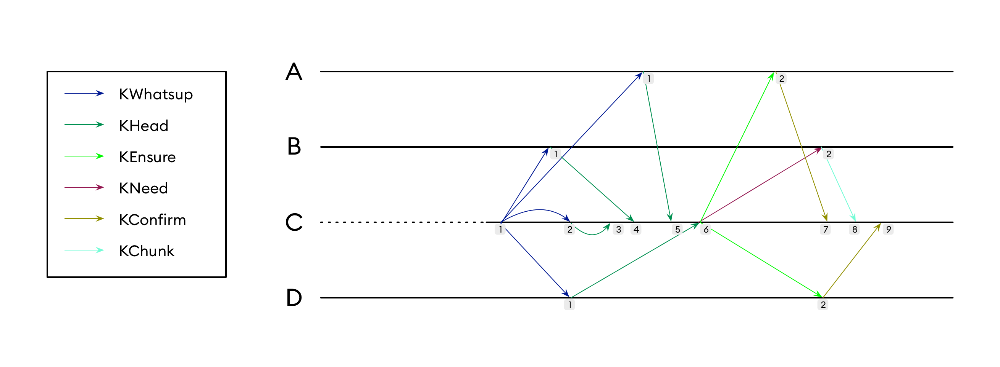

### About

To avoid verticalization of code, each type of exchange between distributed processes has its own named message bearing the data of the exchange. No general containers like "KMessage" is used. The approach helps to avoid different kinds of switch cases (by type, by enum value or flag) and their combinations. It also eliminates the questions of the kind "is the field A is used when the flag F is set?". The drawback, however is that it leads to some duplication of data fields (see [types.go](../types.go)). It requires to design many types of messages, some even without payload, to represent all possible communications between distributed processes.

This document aims to clarify message exchanges in various states of BFT algorithm: normal mode, faults, catch-up and idle. It also highlights some key points of consensus protocol, for the complete description see [References](README.md#references).

### Examples

In our examples we will assume a system with six processes:

* four server processes: `A`, `B`, `C` and `D`
* one client process `L`
* one user process `U`

User process is the one that uses Kayak to store data, it's external to the library. Technically, user and client processes are parts of a single binary and communicate through funtction calls, not through the network. They're separated purely for clarity.

We will also say that the current leader is process `B`, and, if it fails, `C` should take its place.

Each process has its local timer, which is incremented each time a message or timeout is received. To reference an event of process `C` happened at time `7`, we will simply put `C_7`.

In the case of four server processes byzantine quorum equals three, which explains why in almost all cases process unblocks on third confirmation.

If not mentioned otherwise, "sends to all server processes" includes sending to itself. The code could optimise this case to avoid involving network stack of loopback interface, but it doesn't change much from the algorithmic point of view. Upon reception, any message is handled the same way, whether it has been sent by the other process or by the same.

### Normal mode

Most of the time all processes are up and running, none of them runs some mallicious Byzantine code, network conditions are good, meaning that all messages are delivered in time, and all processes are perfectly synchronized, i.e. they all have the same transaction log. We will call these conditions normal mode. In normal mode there's always some flow of entries to be added, originating from clients. It is needed to distinguish normal mode from idle mode when nothing happens.

Consensus protocol runs in rounds. Each round results into adding a single log entry. New round is initiated by user code at `U_1`. User code calls `kayak.ReceiveCall` and puts `KCall` as a single argument. `KCall` contains arbitrary data blob to be added along with the tag.

At some point `U` receives back the status of the call in the form of `KReturn`. Since `U` submits calls asynchronously, upon reception of `KReturn` it should know which call it corresponds to. Both `KCall` and `KReturn` contain the tag. `U` randomly generates the tag for each call, which is then reappears `KReturn` to identify the original call. Client `L` guarantees that all calls will be answered, whether with success or with error.

When `L` receives the call, it broadcasts `KRequest` message to all servers. The message contains the data blob from original `KCall`. Once `L` finishshed the broadcast it waits till it receives three identical `KResponse` messages. In our case that happens at `L_4` when the `KReturn` is sent back. If it doesn't happen, after the timeout `KReturn` is sent anyway with the corresponding indication of failure. Sending by timeout requires setting the timer. The timer is set at `L_1`, but in our (normal) case it's not triggered, and therefor is not shown on the schema.

All four server processes receive the same `KRequest`, but only process `B` proceeds, since the process `B` is the leader. `B` at `B_1` sends to all server processes `KPropose` message, implementing first phase of the consensus round.

When a server receives `KPropose` it immediately broadcasts `KWrite` message. `KWrite` contains the hash of the data previously received in `KPropose`. Hashing helps to reduce the amount of data being exchanged over the network.

After sending of `KWrite` each server waits till it receives three identical `KWrite` messages. It happens at `A_5`, `B_6`, `C_6` and `D_5`. We assume that the messages arrive out of order, and processes are not synchronised in any way that is not implemented by the protocol itself.

When enough `KWrite` messages received, the servers repeat the broadcast with `KAccept` messages. At `A_8`, `B_8`, `C_9` and `D_8` enough (three) identical `KAccept` is received, and servers send back to `L` `KResponse` message. Three identical responses received at `L_4`.

In normal case a process waits for three out of four messages and then proceeds. At some point later in time the fourth message may arrive. That's the case of `A_8`, `A_10`, `B_9`, `B_10`, `C_7`, `C_10`, `D_9`, `D_10` and `L_5`. In this case the messages are just discarded.

### Faulty follower

### Faulty leader

### Catch-up

### Idle mode

